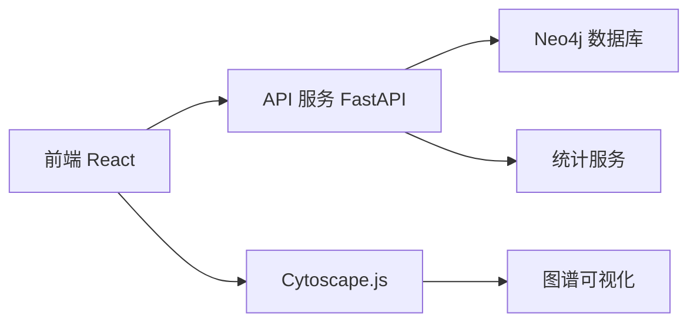

# 项目结构说明

## 📁 整体结构

```
web/
├── 📄 README.md                    # 项目主文档
├── 📄 WEB_DEVELOPMENT_PLAN.md     # 开发计划文档
├── 📄 SCRIPTS_USAGE.md            # 脚本使用指南
├── 📄 PROJECT_STRUCTURE.md        # 项目结构说明（本文件）
├── 🚀 start.sh                    # 智能启动脚本
├── 🛑 stop.sh                     # 停止服务脚本
├── 📊 status.sh                   # 状态检查脚本
├── 🔄 restart.sh                  # 重启服务脚本
├── 📦 backend/                    # 后端服务目录
└── 🎨 frontend/                   # 前端应用目录
```

---

## 🚀 启动脚本

### `start.sh` - 智能启动脚本

- **功能**：一键启动所有服务
- **特性**：
  - 自动检测端口冲突并释放
  - 检查依赖完整性
  - 后台运行服务
  - 彩色状态输出

### `stop.sh` - 停止脚本

- **功能**：优雅停止所有服务
- **特性**：
  - 通过 PID 文件控制
  - 可选择保留日志
  - 清理进程和文件

### `status.sh` - 状态脚本

- **功能**：实时显示服务状态
- **特性**：
  - 显示 PID、内存、CPU 占用
  - HTTP 健康检查
  - 日志文件信息

### `restart.sh` - 重启脚本

- **功能**：一键重启所有服务
- **特性**：保留日志，无缝重启

---

## 📦 后端服务 (`backend/`)

```
backend/
├── 📄 README.md              # 后端说明文档
├── 📄 requirements.txt       # Python 依赖
├── 🔧 .env                   # 环境变量配置
├── 🔧 .env.example           # 环境变量模板
├── 🧪 test_neo4j.py         # Neo4j 测试脚本
└── 📁 app/                   # 应用代码
    ├── 📄 __init__.py
    ├── 🚀 main.py           # FastAPI 应用入口
    ├── 🔧 config.py          # 配置管理
    ├── 📁 routers/           # API 路由
    │   ├── 📄 __init__.py
    │   ├── 📄 graph.py       # 图谱 API
    │   ├── 📄 stats.py       # 统计 API
    │   └── 📄 health.py      # 健康检查
    ├── 📁 services/          # 业务逻辑
    │   ├── 📄 __init__.py
    │   ├── 📄 graph_service.py # 图谱服务
    │   └── 📄 stats_service.py # 统计服务
    ├── 📁 models/            # 数据模型
    │   ├── 📄 __init__.py
    │   ├── 📄 graph.py       # 图谱模型
    │   └── 📄 stats.py       # 统计模型
    └── 📁 database/          # 数据库连接
        ├── 📄 __init__.py
        └── 📄 neo4j.py       # Neo4j 连接
```

### 后端技术栈

- **框架**：FastAPI 0.104+
- **数据库**：Neo4j 5.x + Python Driver
- **配置**：Pydantic Settings
- **服务器**：Uvicorn
- **依赖管理**：pip + requirements.txt

### API 端点

```
GET  /health                  # 健康检查
GET  /api/graph/              # 获取图谱数据
GET  /api/graph/subgraph/{node} # 获取子图
POST /api/graph/path          # 路径查询
GET  /api/stats/              # 获取统计数据
```

---

## 🎨 前端应用 (`frontend/`)

```
frontend/
├── 📄 README.md              # 前端说明文档
├── 📄 package.json           # Node.js 依赖
├── 📄 package-lock.json      # 依赖锁定文件
├── 📄 vite.config.ts         # Vite 配置
├── 📄 tsconfig.json          # TypeScript 配置
├── 📄 tailwind.config.js     # Tailwind CSS 配置
├── 📄 postcss.config.js      # PostCSS 配置
├── 📄 eslint.config.js       # ESLint 配置
├── 🔧 .env                   # 环境变量
├── 📁 public/                # 静态资源
│   └── 🖼️ favicon.ico
├── 📁 src/                   # 源代码
│   ├── 📄 main.tsx           # 应用入口
│   ├── 📄 App.tsx            # 主应用组件
│   ├── 📄 index.css          # 全局样式
│   ├── 📁 components/        # 组件
│   │   ├── 🎨 GraphViewer.tsx # 图谱可视化
│   │   ├── 📊 StatsPanel.tsx  # 统计面板
│   │   └── 📋 NodeDetail.tsx  # 节点详情
│   ├── 📁 services/          # API 服务
│   │   └── 🌐 api.ts         # API 客户端
│   ├── 📁 types/             # 类型定义
│   │   └── 📋 graph.ts       # 图谱类型
│   └── 📁 utils/             # 工具函数
│       └── 🎨 colors.ts      # 颜色配置
└── 📁 node_modules/          # 依赖包（自动生成）
```

### 前端技术栈

- **框架**：React 19 + TypeScript
- **构建工具**：Vite 5.x
- **样式**：Tailwind CSS v4
- **图谱可视化**：Cytoscape.js
- **状态管理**：React Query
- **HTTP 客户端**：Axios
- **代码规范**：ESLint

### 主要功能

- 🎨 交互式图谱可视化
- 🔍 智能搜索与筛选
- 📊 实时数据统计
- 📋 节点详情面板
- 🎨 节点颜色分类
- 📱 响应式设计

---

## 🔧 配置文件

### 环境变量

```bash
# 后端 (.env)
NEO4J_URI=neo4j://127.0.0.1:7687
NEO4J_USERNAME=neo4j
NEO4J_PASSWORD=12345678
CORS_ORIGINS=["http://localhost:5173"]

# 前端 (.env)
VITE_API_URL=http://localhost:8000
```

### 端口配置

| 服务       | 端口 | 说明            |
| ---------- | ---- | --------------- |
| 前端       | 5173 | Vite 开发服务器 |
| 后端       | 8000 | FastAPI 服务    |
| Neo4j Bolt | 7687 | 数据库连接      |
| Neo4j HTTP | 7474 | Web 管理界面    |

---

## 📝 日志文件

所有服务日志统一保存在 `/tmp/` 目录：

```bash
/tmp/pwd-backend.log    # 后端服务日志
/tmp/pwd-frontend.log   # 前端服务日志
/tmp/pwd-backend.pid    # 后端进程 PID
/tmp/pwd-frontend.pid   # 前端进程 PID
```

---

## 🚀 部署说明

### 开发环境

```bash
cd web
./start.sh              # 一键启动
./status.sh             # 查看状态
./stop.sh               # 停止服务
```

### 生产环境（建议）

1. **容器化部署**：使用 Docker + Docker Compose
2. **进程管理**：使用 systemd 或 PM2
3. **反向代理**：使用 Nginx
4. **负载均衡**：使用 Nginx 或 HAProxy

---

## 📊 数据流



---

## 🎯 开发规范

### 代码风格

- **后端**：遵循 PEP 8，使用 Black 格式化
- **前端**：使用 ESLint + Prettier
- **提交**：使用 Conventional Commits

### 分支策略

- `main`：生产环境代码
- `develop`：开发环境代码
- `feature/*`：功能分支
- `hotfix/*`：紧急修复

### 版本控制

- 使用 Git 进行版本控制
- 重要节点打 Tag
- 定期合并到主分支

---

## 📚 文档链接

- [开发计划](./WEB_DEVELOPMENT_PLAN.md)
- [脚本使用指南](./SCRIPTS_USAGE.md)
- [后端 API 文档](http://localhost:8000/docs)
- [前端应用](http://localhost:5173)
- [Neo4j Browser](http://localhost:7474)

---

## 🤝 贡献指南

1. Fork 项目
2. 创建功能分支
3. 提交代码变更
4. 编写测试用例
5. 提交 Pull Request

---

## 📄 许可证

本项目采用 MIT 许可证，详见 LICENSE 文件。
